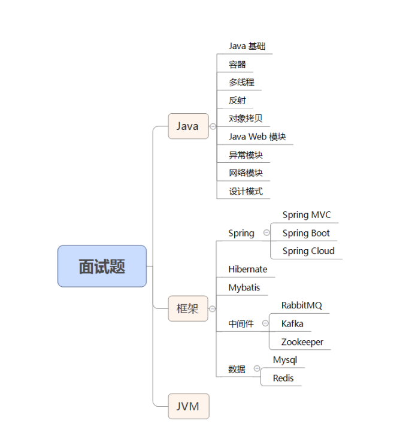

# 面试200+



## Java基础

**1. JDK和JRE有什么区别?**

​	JDK : Java Development Kit 的简称 , Java开发包 , 提供了 Java 的开发环境和运行环境 . 

​	JRE : Java Runtime Environment 的简称 , Java 运行环境 , 为 Java 的运行环境提供了所需 . 具体来说 JDK 其实包含了 JRE , 同时还包含了编译 Java 源码的编译器 Javac , 还包含了很多 Java 程序测试和分析的工具 . 简单来说 : 如果你需要运行 Java程序 , 只需安装 JRE 就可以了 , 如果你需要编写 Java 程序 , 需要安装 JDK.

****

**2. == 和 equals 的区别是什么?**

​	== 解读 : 对于基本类型和引用类型 == 的作用效果是不同的 , 如下所示 : 

​	基本类型 : 比较的是值是否相同 ;

​	引用类型 : 比较的是引用是否相同 ;

​	代码示例:

```java
String x = "string";
String y = "string";
String z = new String("string");
System.out.println(x == y); // true
System.out.println(x == z); // false
System.out.println(x.equals(y)); // true
System.out.println(x.equals(z)); // true
```

​	代码解读 : 因为 x 和 y 指向的是同一个引用 , 所以 == 也是 true , 而 new String() 方法则重写开辟内存空间 , 所以 == 结果为 false , 而 equals 比较的一直是值 , 所以结果都为true.


​	equals 解读 : equals 本质上就是 == , 只不过 String 和 Integer 等重写了 equals 方法, 把它变成了值比较 . 看下面的代码就明白了.

​	首先来看默认情况下 equals 比较一个有相同值的对象 , 代码如下 : 

```java
class Cat {
    public Cat (String name) {
        this.name = name;
    }
    
    private String name;
    
    public String getName() {
        return name;
    }
    
    public void setName() {
        this.name = name;
    }
    
}

Cat c1 = new Cat("zs");
Cat c2 = new Cat("zs");
System.out.println(c1.equals(c2));  // false
// 输出结果出乎意料,是false,下面来看下equals源码:
public boolean equals(Object obj) {
    return (this == obj);
}
// equals 本质上就是 == ,那为什么两个相同值的String对象,返回的值是true
String s1 = new String("lisi");
String s2 = new String("lisi");
System.out.println(s1.equals(s2)); // true
// 当我们进入 String的equals 方法,找到了答案: 代码如下:
public boolean equals(Object anObject) {
    if (this == anObject) {
        return true;
    }
    if (this == anObject) {
        return true;
    }
    if (anObject instanceof String) {
        String anotherString = (String)anObject;
        int n = value.length;
        if (n == anotherString.value.length) {
            char v1[] = value;
            char v2[] = anotherString.value;
            int i = 0;
            while (n-- != 0) {
                if (v1[i] != v2[i]) {
                    return false;
                    i++;
                }
            }
            return true;
        }
    }
    return false;
}
```

​	原来是 String 重写了 Object 的 equals 方法 , 把引用比较改成了值比较.

​	总结 : == 对于基本类型来说是值比较 , 对于引用类型来说是比较的引用; 而equals 默认情况下是引用比较 , 只是很多类重写了 equals 方法 , 比如 String , Integer 等把它变成了值比较 , 所以一般情况下 equals 比较的是值是否相等

****

**3. 两个对象的 hashCode() 相同 , 则 equals() 也一定为 true , 对吗?**

​	不对 . 两个对象的 hashCode() 相同 , equals() 不一定 true

​	代码示例:

```java
String str1 = "通话";
String str2 = "重地";
System.out.println(String.format("str1: %d | str2: %d" , str1.hashCode(), str2.hashCode()));
System.out.println(str1.equals(str2));
// 执行的结果:
	str1:1179395 | str2: 1179395
    false
```

​	代码解读 : 很显然"通话"和"重地"的 hashCode() 相同 , 然而 equals() 则为 false , 因为在散列表中 , hashCode() 相等即两个键值对的哈希值相等,然而哈希值相等 , 并不一定能得出键值对相等

****

**4. final 在 Java 中有什么作用?**

​	final 修饰的类叫最终类 , 该类不能被继承

​	final 修饰的方法不能被重写

​	final 修饰的变量叫常量 , 常量必须初始化 , 初始化之后值就不能被修改

****

**5. Java中的 Math.round(-1.5) 等于多少?**

​	等于 -1 , Math.round 四舍五入大于 0.5 向上取整的

****

**6. String 属于基础的数据类型吗?**

​	String 不属于基础类型 , 基础类型有8种: `byte` , `boolean` , `char` , `short` , `int` , `float` , `long` , `double` , 而 String 属于对象

****

**7. Java中操作字符都有哪些类? 它们之间有什么区别?**

​	操作字符串的类有 : String , StringBuffer , StringBuilder

​	String 和 StringBuffer , StringBuilder 的区别在于 String 声明的是不可变的对象 , 每次操作都会生成新的 String 对象 , 然后将指针指向新的 String 对象 , 而 StringBuffer , StringBuilder 可以在原有对象的基础上进行操作 , 所以经常改变字符串内容的情况下最好不要使用 String.

​	StringBuffer 和 StringBuilder 最大的区别在于 , StringBuffer 是线程安全的 , 而 StringBuilder 是非线程安全的 , 但 StringBuilder 的性能却高于 StringBuffer , 所以在单线程环境下推荐使用StringBuilder , 多线程环境下推荐使用 StringBuffer.

****

**8. String str = "i" 与 String str = new String("i")一样吗?**

​	不一样 , 因为内存分配方式不一样 , String str = "i" 的方式 , Java 虚拟机会将其分配到常量池中; 而String str = new String("i") 则会被分到堆内存中.

****

**9. 如何将字符串反转?**

​	使用 StringBuilder 或者 StringBuffer 的 reverse() 方法

​	实例代码:

```java
// StringBuffer reverse
StringBuffer stringBuffer = new StringBuffer();
stringBuffer.append("abcd");
System.out.println(stringBuffer.reverse());
// StringBuilder reverse
StringBuilder stringBuilder = new StringBuilder();
stringBuilder.append("abcd");
System.out.println(stringBuilder.reverse());
```

****

**10. String 类的常用方法都有哪些?**

​	`indexOf()` 返回指定字符的索引 , 

​	`charAt()` 返回指定索引处的字符 , 

​	`replace()` 字符串替换 , 

​	`trim()` 去除字符串两端空白 , 

​	`split()` 分割字符串 , 返回一个分割后的字符串数组 , 

​	`getBytes()` 返回字符串的 byte 类型数组 , 

​	`length()` 返回字符串长度 , 

​	`toLowerCase()` 将字符串转成小写字母 ,

​	`toUpperCase()` 将字符串转成大写字符 ,

​	`substring()` 截取字符串 ,

​	`equals()` 字符串比较

****

**11. 抽象类必须要有抽象方法吗?**

​	不需要 , 抽象类不一定非要有抽象方法

​	示例代码 :

```java
abstract class Cat {
    public static void sayHi() {
        System.out.println("hi~");
    }
}
// 上面代码 , 抽象类并没有抽象方法但完全能正常运行
```

